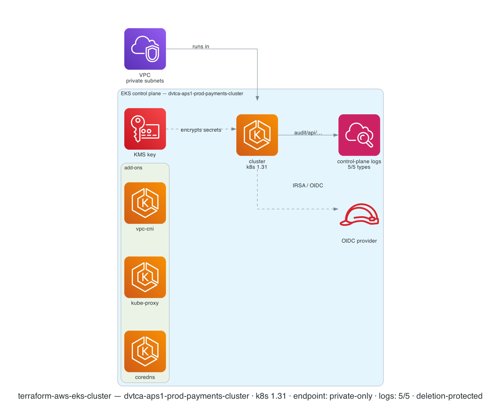

# terraform-aws-eks-cluster

[](https://github.com/devotica-labs/terraform-aws-eks-cluster/actions/workflows/ci.yml)
[](https://github.com/devotica-labs/terraform-aws-eks-cluster/actions/workflows/release.yml)
[](LICENSE)

Production-grade Amazon **EKS control-plane** module for the Devotica catalog. Provisions the cluster, its IAM service role, the OIDC provider for IRSA, secrets-envelope KMS encryption, control-plane logging, EKS access entries, add-ons, capabilities, and optional EKS Auto Mode.

> Hardened for the Devotica catalog: a production-grade EKS control plane with native naming/tagging, **fintech-safe defaults**, and the standard Devotica governance/CI shape. Apache-2.0 — see [`NOTICE`](NOTICE).

This module follows the Devotica module shape: Apache-2.0 licensed, validated inputs, plan-only unit + contract tests, terraform-docs auto-update, central reusable CI from `devotica-labs/terraform-shared-config`, conftest policies from `devotica-labs/terraform-policies`, and signed releases with CycloneDX SBOMs.

<!-- BEGIN_ARCH -->



<sub>Generated by `.github/workflows/architecture-diagram.yml` on every push to main. Do not edit the image by hand — change the Terraform code in `examples/complete/` and the bot will regenerate it.</sub>

<!-- END_ARCH -->

## Scope

| Surface | Covered |
|---|---|
| EKS cluster / control plane | ✅ |
| IAM cluster service role (create or BYO) | ✅ |
| OIDC provider for IRSA | ✅ (default on) |
| Secrets envelope encryption (KMS, create or BYO key) | ✅ (default on) |
| Control-plane logging → CloudWatch (all 5 log types) | ✅ (default on) |
| Private-only API endpoint | ✅ (default; public opt-in + CIDR-scoped) |
| EKS access entries / access policy associations | ✅ |
| EKS add-ons (`vpc-cni`, `coredns`, `kube-proxy`, …) | ✅ |
| EKS capabilities (Argo CD / ACK / KRO) | ✅ |
| EKS Auto Mode (managed compute/storage/LB) | ✅ (opt-in) |
| Managed node groups | ❌ (use a node-group module / Auto Mode) |
| Karpenter / self-managed nodes | ❌ (separate module) |
| Kubernetes-level resources (Helm, manifests) | ❌ (out of scope — control plane only) |

## Quick start

Resource names compose from `namespace` / `environment` / `stage` / `name` (joined by `-`), so the cluster name is e.g. `dvtca-prod-payments-cluster`.

```hcl
module "eks" {
  source  = "devotica-labs/eks-cluster/aws"
  version = "~> 1.0"

  namespace = "dvtca"
  stage     = "prod"
  name      = "payments"

  subnet_ids = module.vpc.private_subnet_ids

  kubernetes_version = "1.31"

  # Fintech defaults already applied: private-only endpoint, OIDC on,
  # secrets encryption on, all 5 control-plane log types at 365d retention,
  # deletion protection on.

  # Who can reach the Kubernetes API (when you later open the public endpoint):
  allowed_security_group_ids = [module.bastion.security_group_id]

  tags = {
    Environment = "production"
    Project     = "payments"
    Owner       = "platform@example.com"
    CostCenter  = "PLATFORM"
    ManagedBy   = "Terraform"
  }
}
```

See [`examples/complete`](examples/complete/main.tf) for the full surface (add-ons, access entries, BYO KMS key, Auto Mode).

## Defaults that matter

Each of these hardened defaults is annotated `# Devotica fintech default` in [`variables.tf`](variables.tf):

- **`endpoint_private_access = true` / `endpoint_public_access = false`** — the Kubernetes API is reachable only from inside the VPC by default. Open the public endpoint deliberately, and `public_access_cidrs` **must** be narrowed (a `check` block flags `0.0.0.0/0`).
- **`oidc_provider_enabled = true`** — IRSA is the baseline workload-identity mechanism; the OIDC provider is created so you can bind IAM roles to service accounts.
- **`cluster_encryption_config_enabled = true`** with **`resources = ["secrets"]`** — Kubernetes Secrets get envelope encryption. The module creates a dedicated KMS key (rotation on, 30-day deletion window) unless you pass `cluster_encryption_config_kms_key_id`.
- **`enabled_cluster_log_types`** = **all five** (`api`, `audit`, `authenticator`, `controllerManager`, `scheduler`) at **`cluster_log_retention_period = 365`** days — `audit` + `authenticator` are what auditors ask for.
- **`deletion_protection_enabled = true`** — the cluster can't be destroyed until protection is removed.
- **`kubernetes_version = "1.31"`** — pinned to a current, AWS-supported minor (upstream still ships the long-EOL `1.21`). Bump deliberately and test in sandbox.
- **`access_config.authentication_mode = "API"`** and **`bootstrap_cluster_creator_admin_permissions = false`** (upstream defaults we keep) — no `aws-auth` ConfigMap, least privilege for the creator.

## How this fits the Devotica catalog

```
terraform-aws-vpc            terraform-aws-kms (optional BYO key)
   │ private subnet IDs         │ secrets-encryption key
   ▼                            ▼
                    terraform-aws-eks-cluster
                          │ OIDC issuer + IRSA
                          │ cluster security group
                          ▼
              node groups / Auto Mode / workloads
              (IRSA roles bind to the OIDC provider)
```

The cluster runs in the VPC's **private** subnets. Pass a `terraform-aws-kms` key as `cluster_encryption_config_kms_key_id` to centralise key management, or let the module mint its own. Worker capacity (managed node groups, Karpenter, or EKS Auto Mode) is intentionally a separate concern — enable Auto Mode here, or attach a node-group module downstream using `eks_cluster_id` + `eks_cluster_managed_security_group_id`.

## Governance

- CI runs the central reusable workflow from `devotica-labs/terraform-shared-config`: fmt, validate, tflint, tfsec/trivy, gitleaks, terraform-docs, conftest against `devotica-labs/terraform-policies`, terraform test, checkov, examples build.
- Releases are cut by `release-please` on Conventional Commits. Each release is keyless-signed via cosign and ships a CycloneDX SBOM.
- Dependabot PRs auto-approve + auto-merge once CI is green.

<!-- BEGIN_TF_DOCS -->


## Usage

### Basic

```hcl
# ---------------------------------------------------------------------------
# Provider block — CI-friendly skip flags + non-AWS-shaped placeholder creds.
# ---------------------------------------------------------------------------
provider "aws" {
  region                      = "ap-south-1"
  access_key                  = "not-a-real-aws-key"
  secret_key                  = "not-a-real-aws-secret"
  skip_credentials_validation = true
  skip_metadata_api_check     = true
  skip_requesting_account_id  = true
}

# Uses local path during development.
# Change to Registry source after first release:
#   source  = "devotica-labs/eks-cluster/aws"
#   version = "~> 0.1"

module "eks" {
  source = "../.."

  # Cluster name composes to: dvtca-sandbox-platform-cluster
  namespace = "dvtca"
  stage     = "sandbox"
  name      = "platform"

  subnet_ids = ["subnet-aaaaaaaaaaaaaaaaa", "subnet-bbbbbbbbbbbbbbbbb"]

  kubernetes_version = "1.31"

  # Fintech defaults already cover the rest: private-only API endpoint,
  # OIDC/IRSA on, Kubernetes Secrets envelope-encrypted with a module-minted
  # KMS key, all five control-plane log types at 365-day retention, and
  # deletion protection on.

  tags = {
    Environment = "sandbox"
    Project     = "terraform-aws-eks-cluster"
    Owner       = "platform@devotica.com"
    CostCenter  = "PLATFORM-OSS"
    ManagedBy   = "Terraform"
    Repo        = "https://github.com/devotica-labs/terraform-aws-eks-cluster"
  }
}
```

### Complete

```hcl
# ---------------------------------------------------------------------------
# Provider block — CI-friendly skip flags + non-AWS-shaped placeholder creds.
# ---------------------------------------------------------------------------
provider "aws" {
  region                      = "ap-south-1"
  access_key                  = "not-a-real-aws-key"
  secret_key                  = "not-a-real-aws-secret"
  skip_credentials_validation = true
  skip_metadata_api_check     = true
  skip_requesting_account_id  = true
}

# Uses local path during development.
# Change to Registry source after first release:
#   source  = "devotica-labs/eks-cluster/aws"
#   version = "~> 0.1"

module "eks" {
  source = "../.."

  # Cluster name composes to: dvtca-aps1-prod-payments-cluster
  namespace   = "dvtca"
  environment = "aps1"
  stage       = "prod"
  name        = "payments"

  subnet_ids = [
    "subnet-aaaaaaaaaaaaaaaaa",
    "subnet-bbbbbbbbbbbbbbbbb",
    "subnet-ccccccccccccccccc",
  ]

  kubernetes_version = "1.31"

  # IRSA / OIDC provider (also the Devotica default).
  oidc_provider_enabled = true

  # Kubernetes Secrets envelope encryption — let the module mint a dedicated
  # KMS key (rotation on, 30-day deletion window).
  cluster_encryption_config_enabled = true

  # Encrypt the control-plane CloudWatch log group with a workload KMS key
  # (e.g. a terraform-aws-kms output). All five log types are on by default.
  cloudwatch_log_group_kms_key_id = "arn:aws:kms:ap-south-1:111122223333:key/00000000-0000-0000-0000-000000000000"

  # Core EKS-managed add-ons.
  addons = [
    { addon_name = "vpc-cni" },
    { addon_name = "coredns" },
    { addon_name = "kube-proxy" },
  ]

  # Source security groups allowed to reach the EKS-managed cluster SG
  # (e.g. a bastion / VPN appliance). The API endpoint stays private.
  allowed_security_group_ids = ["sg-0bastion0000000000"]

  # Grant a platform-admin IAM role cluster-admin via an EKS access entry
  # (authentication_mode = "API", the default — no aws-auth ConfigMap).
  access_entry_map = {
    "arn:aws:iam::111122223333:role/platform-admin" = {
      access_policy_associations = {
        ClusterAdmin = {}
      }
    }
  }

  tags = {
    Environment = "production"
    Project     = "payments"
    Owner       = "platform@devotica.com"
    CostCenter  = "PLATFORM"
    ManagedBy   = "Terraform"
    Repo        = "https://github.com/devotica-labs/terraform-aws-eks-cluster"
  }
}
```

## Requirements

| Name | Version |
|------|---------|
| <a name="requirement_terraform"></a> [terraform](#requirement\_terraform) | >= 1.5.0 |
| <a name="requirement_aws"></a> [aws](#requirement\_aws) | >= 6.25.0 |
| <a name="requirement_tls"></a> [tls](#requirement\_tls) | >= 3.1.0, != 4.0.0 |
## Providers

| Name | Version |
|------|---------|
| <a name="provider_aws"></a> [aws](#provider\_aws) | >= 6.25.0 |
| <a name="provider_tls"></a> [tls](#provider\_tls) | >= 3.1.0, != 4.0.0 |
## Resources

| Name | Type |
|------|------|
| [aws_cloudwatch_log_group.default](https://registry.terraform.io/providers/hashicorp/aws/latest/docs/resources/cloudwatch_log_group) | resource |
| [aws_eks_access_entry.linux](https://registry.terraform.io/providers/hashicorp/aws/latest/docs/resources/eks_access_entry) | resource |
| [aws_eks_access_entry.map](https://registry.terraform.io/providers/hashicorp/aws/latest/docs/resources/eks_access_entry) | resource |
| [aws_eks_access_entry.standard](https://registry.terraform.io/providers/hashicorp/aws/latest/docs/resources/eks_access_entry) | resource |
| [aws_eks_access_entry.windows](https://registry.terraform.io/providers/hashicorp/aws/latest/docs/resources/eks_access_entry) | resource |
| [aws_eks_access_policy_association.list](https://registry.terraform.io/providers/hashicorp/aws/latest/docs/resources/eks_access_policy_association) | resource |
| [aws_eks_access_policy_association.map](https://registry.terraform.io/providers/hashicorp/aws/latest/docs/resources/eks_access_policy_association) | resource |
| [aws_eks_addon.cluster](https://registry.terraform.io/providers/hashicorp/aws/latest/docs/resources/eks_addon) | resource |
| [aws_eks_capability.default](https://registry.terraform.io/providers/hashicorp/aws/latest/docs/resources/eks_capability) | resource |
| [aws_eks_cluster.default](https://registry.terraform.io/providers/hashicorp/aws/latest/docs/resources/eks_cluster) | resource |
| [aws_iam_openid_connect_provider.default](https://registry.terraform.io/providers/hashicorp/aws/latest/docs/resources/iam_openid_connect_provider) | resource |
| [aws_iam_policy.cluster_elb_service_role](https://registry.terraform.io/providers/hashicorp/aws/latest/docs/resources/iam_policy) | resource |
| [aws_iam_role.capability](https://registry.terraform.io/providers/hashicorp/aws/latest/docs/resources/iam_role) | resource |
| [aws_iam_role.default](https://registry.terraform.io/providers/hashicorp/aws/latest/docs/resources/iam_role) | resource |
| [aws_iam_role_policy_attachment.amazon_eks_cluster_policy](https://registry.terraform.io/providers/hashicorp/aws/latest/docs/resources/iam_role_policy_attachment) | resource |
| [aws_iam_role_policy_attachment.amazon_eks_service_policy](https://registry.terraform.io/providers/hashicorp/aws/latest/docs/resources/iam_role_policy_attachment) | resource |
| [aws_iam_role_policy_attachment.auto_mode](https://registry.terraform.io/providers/hashicorp/aws/latest/docs/resources/iam_role_policy_attachment) | resource |
| [aws_iam_role_policy_attachment.cluster_elb_service_role](https://registry.terraform.io/providers/hashicorp/aws/latest/docs/resources/iam_role_policy_attachment) | resource |
| [aws_kms_alias.cluster](https://registry.terraform.io/providers/hashicorp/aws/latest/docs/resources/kms_alias) | resource |
| [aws_kms_key.cluster](https://registry.terraform.io/providers/hashicorp/aws/latest/docs/resources/kms_key) | resource |
| [aws_vpc_security_group_ingress_rule.custom_ingress_rules](https://registry.terraform.io/providers/hashicorp/aws/latest/docs/resources/vpc_security_group_ingress_rule) | resource |
| [aws_vpc_security_group_ingress_rule.managed_ingress_cidr_blocks](https://registry.terraform.io/providers/hashicorp/aws/latest/docs/resources/vpc_security_group_ingress_rule) | resource |
| [aws_vpc_security_group_ingress_rule.managed_ingress_security_groups](https://registry.terraform.io/providers/hashicorp/aws/latest/docs/resources/vpc_security_group_ingress_rule) | resource |
## Inputs

| Name | Description | Type | Default | Required |
|------|-------------|------|---------|:--------:|
| <a name="input_subnet_ids"></a> [subnet\_ids](#input\_subnet\_ids) | A list of subnet IDs to launch the cluster in | `list(string)` | n/a | yes |
| <a name="input_access_config"></a> [access\_config](#input\_access\_config) | Access configuration for the EKS cluster. | <pre>object({<br/>    authentication_mode                         = optional(string, "API")<br/>    bootstrap_cluster_creator_admin_permissions = optional(bool, false)<br/>  })</pre> | `{}` | no |
| <a name="input_access_entries"></a> [access\_entries](#input\_access\_entries) | List of IAM principles to allow to access the EKS cluster.<br/>It is recommended to use the default `user_name` because the default includes<br/>the IAM role or user name and the session name for assumed roles.<br/>Use when Principal ARN is not known at plan time. | <pre>list(object({<br/>    principal_arn     = string<br/>    user_name         = optional(string, null)<br/>    kubernetes_groups = optional(list(string), null)<br/>  }))</pre> | `[]` | no |
| <a name="input_access_entries_for_nodes"></a> [access\_entries\_for\_nodes](#input\_access\_entries\_for\_nodes) | Map of list of IAM roles for the EKS non-managed worker nodes.<br/>The map key is the node type, either `EC2_LINUX` or `EC2_WINDOWS`,<br/>and the list contains the IAM roles of the nodes of that type.<br/>There is no need for or utility in creating Fargate access entries, as those<br/>are always created automatically by AWS, just as with managed nodes.<br/>Use when Principal ARN is not known at plan time. | `map(list(string))` | `{}` | no |
| <a name="input_access_entry_map"></a> [access\_entry\_map](#input\_access\_entry\_map) | Map of IAM Principal ARNs to access configuration.<br/>Preferred over other inputs as this configuration remains stable<br/>when elements are added or removed, but it requires that the Principal ARNs<br/>and Policy ARNs are known at plan time.<br/>Can be used along with other `access_*` inputs, but do not duplicate entries.<br/>Map `access_policy_associations` keys are policy ARNs, policy<br/>full name (AmazonEKSViewPolicy), or short name (View).<br/>It is recommended to use the default `user_name` because the default includes<br/>IAM role or user name and the session name for assumed roles.<br/>As a special case in support of backwards compatibility, membership in the<br/>`system:masters` group is is translated to an association with the ClusterAdmin policy.<br/>In all other cases, including any `system:*` group in `kubernetes_groups` is prohibited. | <pre>map(object({<br/>    # key is principal_arn<br/>    user_name = optional(string)<br/>    # Cannot assign "system:*" groups to IAM users, use ClusterAdmin and Admin instead<br/>    kubernetes_groups = optional(list(string), [])<br/>    type              = optional(string, "STANDARD")<br/>    access_policy_associations = optional(map(object({<br/>      # key is policy_arn or policy_name<br/>      access_scope = optional(object({<br/>        type       = optional(string, "cluster")<br/>        namespaces = optional(list(string))<br/>      }), {}) # access_scope<br/>    })), {})  # access_policy_associations<br/>  }))</pre> | `{}` | no |
| <a name="input_access_policy_associations"></a> [access\_policy\_associations](#input\_access\_policy\_associations) | List of AWS managed EKS access policies to associate with IAM principles.<br/>Use when Principal ARN or Policy ARN is not known at plan time.<br/>`policy_arn` can be the full ARN, the full name (AmazonEKSViewPolicy) or short name (View). | <pre>list(object({<br/>    principal_arn = string<br/>    policy_arn    = string<br/>    access_scope = optional(object({<br/>      type       = optional(string, "cluster")<br/>      namespaces = optional(list(string))<br/>    }), {})<br/>  }))</pre> | `[]` | no |
| <a name="input_addons"></a> [addons](#input\_addons) | Manages [`aws_eks_addon`](https://registry.terraform.io/providers/hashicorp/aws/latest/docs/resources/eks_addon) resources.<br/>Note: `resolve_conflicts` is deprecated. If `resolve_conflicts` is set and<br/>`resolve_conflicts_on_create` or `resolve_conflicts_on_update` is not set,<br/>`resolve_conflicts` will be used instead. If `resolve_conflicts_on_create` is<br/>not set and `resolve_conflicts` is `PRESERVE`, `resolve_conflicts_on_create`<br/>will be set to `NONE`.<br/>If `additional_tags` are specified, they are added to the standard resource tags. | <pre>list(object({<br/>    addon_name           = string<br/>    addon_version        = optional(string, null)<br/>    configuration_values = optional(string, null)<br/>    # resolve_conflicts is deprecated, but we keep it for backwards compatibility<br/>    # and because if not declared, Terraform will silently ignore it.<br/>    resolve_conflicts           = optional(string, null)<br/>    resolve_conflicts_on_create = optional(string, null)<br/>    resolve_conflicts_on_update = optional(string, null)<br/>    service_account_role_arn    = optional(string, null)<br/>    pod_identity_association    = optional(map(string), {})<br/>    create_timeout              = optional(string, null)<br/>    update_timeout              = optional(string, null)<br/>    delete_timeout              = optional(string, null)<br/>    additional_tags             = optional(map(string), {})<br/>  }))</pre> | `[]` | no |
| <a name="input_addons_depends_on"></a> [addons\_depends\_on](#input\_addons\_depends\_on) | If provided, all addons will depend on this object, and therefore not be installed until this object is finalized.<br/>This is useful if you want to ensure that addons are not applied before some other condition is met, e.g. node groups are created. | `any` | `null` | no |
| <a name="input_allowed_cidr_blocks"></a> [allowed\_cidr\_blocks](#input\_allowed\_cidr\_blocks) | A list of IPv4 CIDRs to allow access to the cluster.<br/>The length of this list must be known at "plan" time. | `list(string)` | `[]` | no |
| <a name="input_allowed_security_group_ids"></a> [allowed\_security\_group\_ids](#input\_allowed\_security\_group\_ids) | A list of IDs of Security Groups to allow access to the cluster. | `list(string)` | `[]` | no |
| <a name="input_associated_security_group_ids"></a> [associated\_security\_group\_ids](#input\_associated\_security\_group\_ids) | A list of IDs of Security Groups to associate the cluster with.<br/>These security groups will not be modified. | `list(string)` | `[]` | no |
| <a name="input_auto_mode_compute_config"></a> [auto\_mode\_compute\_config](#input\_auto\_mode\_compute\_config) | EKS Auto Mode compute configuration. When enabled, AWS manages node<br/>provisioning via managed Karpenter. | <pre>object({<br/>    enabled       = optional(bool, false)<br/>    node_pools    = optional(set(string), ["general-purpose", "system"])<br/>    node_role_arn = optional(string, null)<br/>  })</pre> | `{}` | no |
| <a name="input_auto_mode_elastic_load_balancing"></a> [auto\_mode\_elastic\_load\_balancing](#input\_auto\_mode\_elastic\_load\_balancing) | EKS Auto Mode elastic load balancing configuration. When enabled,<br/>AWS manages ALB/NLB creation for Services and Ingress resources. | <pre>object({<br/>    enabled = optional(bool, false)<br/>  })</pre> | `{}` | no |
| <a name="input_auto_mode_storage_config"></a> [auto\_mode\_storage\_config](#input\_auto\_mode\_storage\_config) | EKS Auto Mode storage configuration. When block\_storage is enabled,<br/>AWS manages EBS volumes via the ebs.csi.eks.amazonaws.com provisioner. | <pre>object({<br/>    block_storage = optional(object({<br/>      enabled = optional(bool, false)<br/>    }), {})<br/>  })</pre> | `{}` | no |
| <a name="input_bootstrap_self_managed_addons_enabled"></a> [bootstrap\_self\_managed\_addons\_enabled](#input\_bootstrap\_self\_managed\_addons\_enabled) | Manages bootstrap of default networking addons after cluster has been created. Must be false when Auto Mode is enabled. Changing this forces cluster recreation. | `bool` | `null` | no |
| <a name="input_capabilities"></a> [capabilities](#input\_capabilities) | Map of EKS Capabilities to enable on the cluster. Each key is the capability<br/>name (must be unique within the cluster). Supported types: ACK, ARGOCD, KRO.<br/><br/>When `create_iam_role` is true (default) and `role_arn` is null, an IAM<br/>role with a trust policy for `capabilities.eks.amazonaws.com` is<br/>automatically created. Set `create_iam_role = false` and provide `role_arn`<br/>when the calling module creates its own IAM roles (avoids plan-time unknowns).<br/><br/>The `configuration` block is only applicable to ARGOCD capabilities.<br/>ACK and KRO do not currently support configuration. | <pre>map(object({<br/>    enabled                   = optional(bool, true)<br/>    type                      = string # ACK, ARGOCD, KRO<br/>    create_iam_role           = optional(bool, true)<br/>    role_arn                  = optional(string, null)<br/>    delete_propagation_policy = optional(string, "RETAIN")<br/>    configuration = optional(object({<br/>      argo_cd = optional(object({<br/>        namespace = optional(string, "argocd")<br/>        aws_idc = optional(object({<br/>          idc_instance_arn = string<br/>          idc_region       = optional(string, null)<br/>        }), null)<br/>        network_access = optional(object({<br/>          vpce_ids = optional(list(string), [])<br/>        }), null)<br/>        rbac_role_mapping = optional(list(object({<br/>          role = string # ADMIN, EDITOR, VIEWER<br/>          identity = list(object({<br/>            id   = string<br/>            type = string # SSO_USER, SSO_GROUP<br/>          }))<br/>        })), [])<br/>      }), null)<br/>    }), null)<br/>    create_timeout = optional(string, null)<br/>    update_timeout = optional(string, null)<br/>    delete_timeout = optional(string, null)<br/>  }))</pre> | `{}` | no |
| <a name="input_cloudwatch_log_group_class"></a> [cloudwatch\_log\_group\_class](#input\_cloudwatch\_log\_group\_class) | Specified the log class of the log group. Possible values are: `STANDARD` or `INFREQUENT_ACCESS` | `string` | `null` | no |
| <a name="input_cloudwatch_log_group_kms_key_id"></a> [cloudwatch\_log\_group\_kms\_key\_id](#input\_cloudwatch\_log\_group\_kms\_key\_id) | If provided, the KMS Key ID to use to encrypt AWS CloudWatch logs | `string` | `null` | no |
| <a name="input_cluster_attributes"></a> [cluster\_attributes](#input\_cluster\_attributes) | Extra name segments appended after `name` when composing the cluster name. Default `["cluster"]` yields e.g. `dvtca-prod-payments-cluster`. | `list(string)` | <pre>[<br/>  "cluster"<br/>]</pre> | no |
| <a name="input_cluster_depends_on"></a> [cluster\_depends\_on](#input\_cluster\_depends\_on) | If provided, the EKS will depend on this object, and therefore not be created until this object is finalized.<br/>This is useful if you want to ensure that the cluster is not created before some other condition is met, e.g. VPNs into the subnet are created. | `any` | `null` | no |
| <a name="input_cluster_encryption_config_enabled"></a> [cluster\_encryption\_config\_enabled](#input\_cluster\_encryption\_config\_enabled) | Set to `true` to enable Cluster Encryption Configuration | `bool` | `true` | no |
| <a name="input_cluster_encryption_config_kms_key_deletion_window_in_days"></a> [cluster\_encryption\_config\_kms\_key\_deletion\_window\_in\_days](#input\_cluster\_encryption\_config\_kms\_key\_deletion\_window\_in\_days) | Cluster Encryption Config KMS Key Resource argument - key deletion window in days post destruction. | `number` | `30` | no |
| <a name="input_cluster_encryption_config_kms_key_enable_key_rotation"></a> [cluster\_encryption\_config\_kms\_key\_enable\_key\_rotation](#input\_cluster\_encryption\_config\_kms\_key\_enable\_key\_rotation) | Cluster Encryption Config KMS Key Resource argument - enable kms key rotation | `bool` | `true` | no |
| <a name="input_cluster_encryption_config_kms_key_id"></a> [cluster\_encryption\_config\_kms\_key\_id](#input\_cluster\_encryption\_config\_kms\_key\_id) | KMS Key ID to use for cluster encryption config | `string` | `""` | no |
| <a name="input_cluster_encryption_config_kms_key_policy"></a> [cluster\_encryption\_config\_kms\_key\_policy](#input\_cluster\_encryption\_config\_kms\_key\_policy) | Cluster Encryption Config KMS Key Resource argument - key policy | `string` | `null` | no |
| <a name="input_cluster_encryption_config_resources"></a> [cluster\_encryption\_config\_resources](#input\_cluster\_encryption\_config\_resources) | Cluster Encryption Config Resources to encrypt, e.g. ['secrets'] | `list(any)` | <pre>[<br/>  "secrets"<br/>]</pre> | no |
| <a name="input_cluster_log_retention_period"></a> [cluster\_log\_retention\_period](#input\_cluster\_log\_retention\_period) | Number of days to retain control plane logs. Devotica defaults to 365 to satisfy typical fintech retention requirements. | `number` | `365` | no |
| <a name="input_create_eks_service_role"></a> [create\_eks\_service\_role](#input\_create\_eks\_service\_role) | Set `false` to use existing `eks_cluster_service_role_arn` instead of creating one | `bool` | `true` | no |
| <a name="input_custom_ingress_rules"></a> [custom\_ingress\_rules](#input\_custom\_ingress\_rules) | A List of Objects, which are custom security group rules that | <pre>list(object({<br/>    description              = string<br/>    from_port                = number<br/>    to_port                  = number<br/>    protocol                 = string<br/>    source_security_group_id = string<br/>  }))</pre> | `[]` | no |
| <a name="input_deletion_protection_enabled"></a> [deletion\_protection\_enabled](#input\_deletion\_protection\_enabled) | Whether to enable deletion protection for the cluster. When enabled, the cluster cannot be deleted until deletion protection is first disabled. Devotica defaults this ON for production-grade safety. | `bool` | `true` | no |
| <a name="input_delimiter"></a> [delimiter](#input\_delimiter) | Delimiter joining the resource-name segments. | `string` | `"-"` | no |
| <a name="input_eks_cluster_service_role_arn"></a> [eks\_cluster\_service\_role\_arn](#input\_eks\_cluster\_service\_role\_arn) | The ARN of an IAM role for the EKS cluster to use that provides permissions<br/>for the Kubernetes control plane to perform needed AWS API operations.<br/>Required if `create_eks_service_role` is `false`, ignored otherwise. | `string` | `null` | no |
| <a name="input_enabled"></a> [enabled](#input\_enabled) | Set to false to make this module a no-op (create nothing). | `bool` | `true` | no |
| <a name="input_enabled_cluster_log_types"></a> [enabled\_cluster\_log\_types](#input\_enabled\_cluster\_log\_types) | Control plane log types to ship to CloudWatch. Possible values [`api`, `audit`, `authenticator`, `controllerManager`, `scheduler`]. Devotica enables all five — `audit` and `authenticator` are the ones auditors ask for. | `list(string)` | <pre>[<br/>  "api",<br/>  "audit",<br/>  "authenticator",<br/>  "controllerManager",<br/>  "scheduler"<br/>]</pre> | no |
| <a name="input_endpoint_private_access"></a> [endpoint\_private\_access](#input\_endpoint\_private\_access) | Whether the Amazon EKS private API server endpoint is enabled. Devotica defaults this ON so the control plane is reachable from inside the VPC. | `bool` | `true` | no |
| <a name="input_endpoint_public_access"></a> [endpoint\_public\_access](#input\_endpoint\_public\_access) | Whether the Amazon EKS public API server endpoint is enabled. Devotica defaults this OFF — the API is reachable only from inside the VPC (or via a bastion/VPN). Set true only with a narrowed public\_access\_cidrs. | `bool` | `false` | no |
| <a name="input_environment"></a> [environment](#input\_environment) | Environment segment used to compose resource names (e.g. a short region code). | `string` | `null` | no |
| <a name="input_kubernetes_network_ipv6_enabled"></a> [kubernetes\_network\_ipv6\_enabled](#input\_kubernetes\_network\_ipv6\_enabled) | Set true to use IPv6 addresses for Kubernetes pods and services | `bool` | `false` | no |
| <a name="input_kubernetes_version"></a> [kubernetes\_version](#input\_kubernetes\_version) | Desired Kubernetes control plane version. Devotica pins a current, AWS-supported version rather than letting it float; bump deliberately and test in sandbox first. | `string` | `"1.31"` | no |
| <a name="input_managed_security_group_rules_enabled"></a> [managed\_security\_group\_rules\_enabled](#input\_managed\_security\_group\_rules\_enabled) | Flag to enable/disable the ingress and egress rules for the EKS managed Security Group | `bool` | `true` | no |
| <a name="input_name"></a> [name](#input\_name) | Base name used to compose resource names (e.g. "payments"). | `string` | `null` | no |
| <a name="input_namespace"></a> [namespace](#input\_namespace) | Namespace / org prefix used to compose resource names (e.g. "dvtca"). | `string` | `null` | no |
| <a name="input_oidc_provider_enabled"></a> [oidc\_provider\_enabled](#input\_oidc\_provider\_enabled) | Create an IAM OIDC identity provider for the cluster, then you can create IAM roles to associate with a<br/>service account in the cluster, instead of using kiam or kube2iam. For more information,<br/>see [EKS User Guide](https://docs.aws.amazon.com/eks/latest/userguide/enable-iam-roles-for-service-accounts.html). | `bool` | `true` | no |
| <a name="input_permissions_boundary"></a> [permissions\_boundary](#input\_permissions\_boundary) | If provided, all IAM roles will be created with this permissions boundary attached | `string` | `null` | no |
| <a name="input_public_access_cidrs"></a> [public\_access\_cidrs](#input\_public\_access\_cidrs) | CIDR blocks allowed to reach the public EKS API endpoint (only relevant when `endpoint_public_access = true`). Devotica defaults to an empty list: when you opt into the public endpoint you must supply your own office/VPN allow-list — the `public_endpoint_restricted` check refuses 0.0.0.0/0. | `list(string)` | `[]` | no |
| <a name="input_region"></a> [region](#input\_region) | OBSOLETE (not needed): AWS Region | `string` | `null` | no |
| <a name="input_remote_network_config"></a> [remote\_network\_config](#input\_remote\_network\_config) | Configuration block for the cluster remote network configuration | <pre>object({<br/>    remote_node_networks_cidrs = list(string)<br/>    remote_pod_networks_cidrs  = optional(list(string))<br/>  })</pre> | `null` | no |
| <a name="input_service_ipv4_cidr"></a> [service\_ipv4\_cidr](#input\_service\_ipv4\_cidr) | The CIDR block to assign Kubernetes service IP addresses from.<br/>You can only specify a custom CIDR block when you create a cluster, changing this value will force a new cluster to be created. | `string` | `null` | no |
| <a name="input_stage"></a> [stage](#input\_stage) | Stage / account segment used to compose resource names (e.g. "prod"). | `string` | `null` | no |
| <a name="input_tags"></a> [tags](#input\_tags) | Tags applied to every taggable resource this module creates. | `map(string)` | `{}` | no |
| <a name="input_upgrade_policy"></a> [upgrade\_policy](#input\_upgrade\_policy) | Configuration block for the support policy to use for the cluster | <pre>object({<br/>    support_type = optional(string, null)<br/>  })</pre> | `null` | no |
| <a name="input_zonal_shift_config"></a> [zonal\_shift\_config](#input\_zonal\_shift\_config) | Configuration block with zonal shift configuration for the cluster | <pre>object({<br/>    enabled = optional(bool, null)<br/>  })</pre> | `null` | no |
## Outputs

| Name | Description |
|------|-------------|
| <a name="output_auto_mode_enabled"></a> [auto\_mode\_enabled](#output\_auto\_mode\_enabled) | Whether EKS Auto Mode is enabled (all three capabilities: compute, storage, networking) |
| <a name="output_capabilities"></a> [capabilities](#output\_capabilities) | Map of enabled EKS Capabilities with their ARNs and types |
| <a name="output_capability_role_arns"></a> [capability\_role\_arns](#output\_capability\_role\_arns) | Map of auto-created capability IAM role ARNs |
| <a name="output_cloudwatch_log_group_kms_key_id"></a> [cloudwatch\_log\_group\_kms\_key\_id](#output\_cloudwatch\_log\_group\_kms\_key\_id) | KMS Key ID to encrypt AWS CloudWatch logs |
| <a name="output_cloudwatch_log_group_name"></a> [cloudwatch\_log\_group\_name](#output\_cloudwatch\_log\_group\_name) | The name of the log group created in cloudwatch where cluster logs are forwarded to if enabled |
| <a name="output_cluster_encryption_config_enabled"></a> [cluster\_encryption\_config\_enabled](#output\_cluster\_encryption\_config\_enabled) | If true, Cluster Encryption Configuration is enabled |
| <a name="output_cluster_encryption_config_provider_key_alias"></a> [cluster\_encryption\_config\_provider\_key\_alias](#output\_cluster\_encryption\_config\_provider\_key\_alias) | Cluster Encryption Config KMS Key Alias ARN |
| <a name="output_cluster_encryption_config_provider_key_arn"></a> [cluster\_encryption\_config\_provider\_key\_arn](#output\_cluster\_encryption\_config\_provider\_key\_arn) | Cluster Encryption Config KMS Key ARN |
| <a name="output_cluster_encryption_config_resources"></a> [cluster\_encryption\_config\_resources](#output\_cluster\_encryption\_config\_resources) | Cluster Encryption Config Resources |
| <a name="output_eks_addons_versions"></a> [eks\_addons\_versions](#output\_eks\_addons\_versions) | Map of enabled EKS Addons names and versions |
| <a name="output_eks_cluster_arn"></a> [eks\_cluster\_arn](#output\_eks\_cluster\_arn) | The Amazon Resource Name (ARN) of the cluster |
| <a name="output_eks_cluster_certificate_authority_data"></a> [eks\_cluster\_certificate\_authority\_data](#output\_eks\_cluster\_certificate\_authority\_data) | The Kubernetes cluster certificate authority data |
| <a name="output_eks_cluster_endpoint"></a> [eks\_cluster\_endpoint](#output\_eks\_cluster\_endpoint) | The endpoint for the Kubernetes API server |
| <a name="output_eks_cluster_id"></a> [eks\_cluster\_id](#output\_eks\_cluster\_id) | The name of the cluster |
| <a name="output_eks_cluster_identity_oidc_issuer"></a> [eks\_cluster\_identity\_oidc\_issuer](#output\_eks\_cluster\_identity\_oidc\_issuer) | The OIDC Identity issuer for the cluster |
| <a name="output_eks_cluster_identity_oidc_issuer_arn"></a> [eks\_cluster\_identity\_oidc\_issuer\_arn](#output\_eks\_cluster\_identity\_oidc\_issuer\_arn) | The OIDC Identity issuer ARN for the cluster that can be used to associate IAM roles with a service account |
| <a name="output_eks_cluster_ipv4_service_cidr"></a> [eks\_cluster\_ipv4\_service\_cidr](#output\_eks\_cluster\_ipv4\_service\_cidr) | The IPv4 CIDR block that Kubernetes pod and service IP addresses are assigned from<br/>if `kubernetes_network_ipv6_enabled` is set to false. If set to true this output will be null. |
| <a name="output_eks_cluster_ipv6_service_cidr"></a> [eks\_cluster\_ipv6\_service\_cidr](#output\_eks\_cluster\_ipv6\_service\_cidr) | The IPv6 CIDR block that Kubernetes pod and service IP addresses are assigned from<br/>if `kubernetes_network_ipv6_enabled` is set to true. If set to false this output will be null. |
| <a name="output_eks_cluster_managed_security_group_id"></a> [eks\_cluster\_managed\_security\_group\_id](#output\_eks\_cluster\_managed\_security\_group\_id) | Security Group ID that was created by EKS for the cluster.<br/>EKS creates a Security Group and applies it to the ENI that are attached to EKS Control Plane master nodes and to any managed workloads. |
| <a name="output_eks_cluster_role_arn"></a> [eks\_cluster\_role\_arn](#output\_eks\_cluster\_role\_arn) | ARN of the EKS cluster IAM role |
| <a name="output_eks_cluster_version"></a> [eks\_cluster\_version](#output\_eks\_cluster\_version) | The Kubernetes server version of the cluster |
<!-- END_TF_DOCS -->

## License

Apache-2.0. See [`LICENSE`](LICENSE) and [`NOTICE`](NOTICE).
